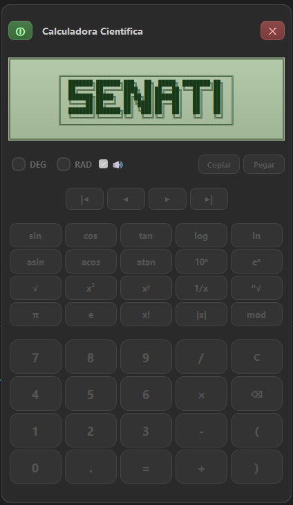
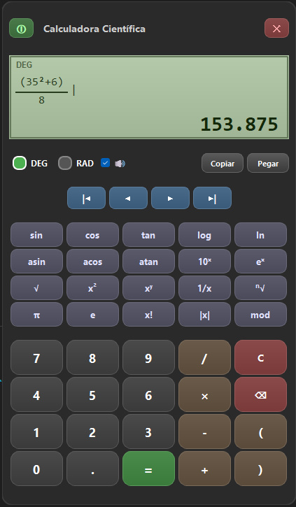

# Calculadora Cientifica (PyQt5)

Aplicacion de escritorio con interfaz personalizada, modo DEG/RAD, funciones cientificas, sonido de teclas y animacion de encendido/apagado.

## Vista de la aplicacion




## Ejecutar en desarrollo

1. Instalar dependencias:

```bash
pip install PyQt5
```

2. Ejecutar:

```bash
python Calculadora.py
```

## Ejecutable (.exe)

El ejecutable generado se encuentra en:

- `dist/Calculadora/Calculadora.exe`

Para volver a compilarlo:

```bash
python -m PyInstaller --noconfirm --windowed --name Calculadora --add-data "calculadora.qss;." --add-data "PRENDER.mp3;." --add-data "APAGAR.mp3;." --add-data "click.wav;." Calculadora.py
```

## Estructura principal

- `Calculadora.py`: app principal
- `calculadora.qss`: estilos
- `PRENDER.mp3`, `APAGAR.mp3`, `click.wav`: audio
- `dist/Calculadora/Calculadora.exe`: binario compilado

## Notas

- Si ejecutas con Code Runner y aparece un archivo temporal, ya esta corregido para no romper la ejecucion.
- Si no escuchas audio, verifica que los archivos `.mp3` y `.wav` esten junto al ejecutable o incluidos en `dist`.
